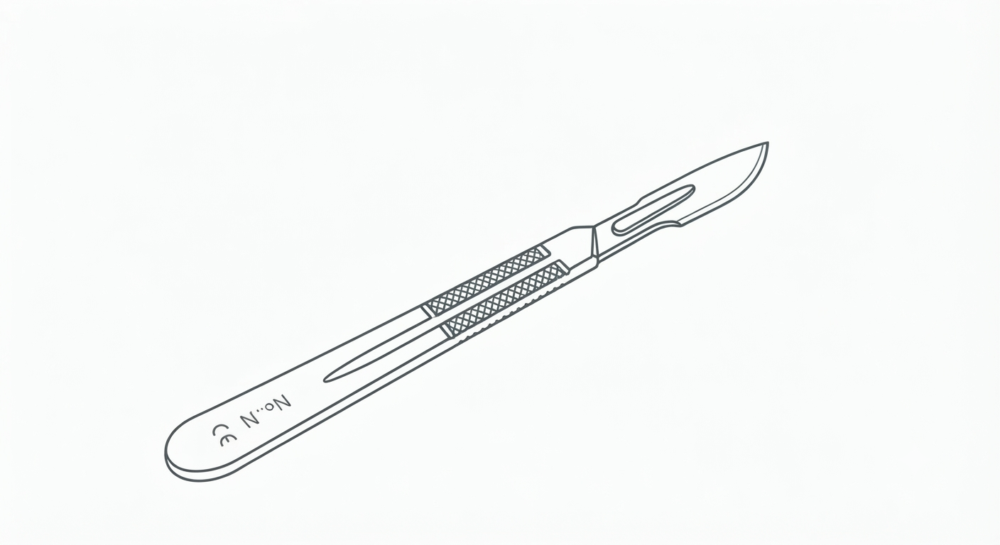
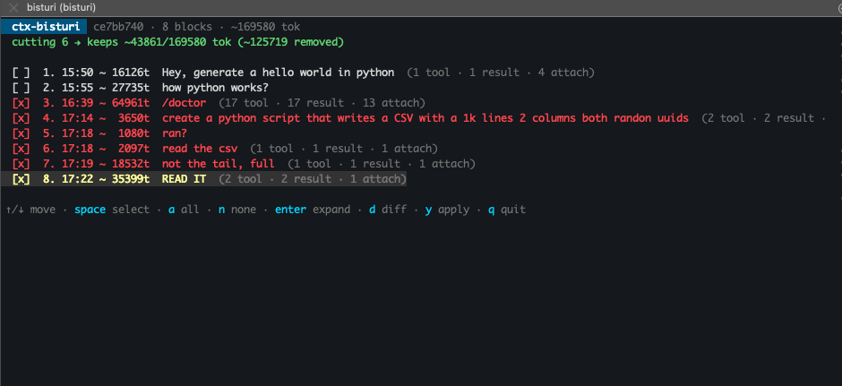
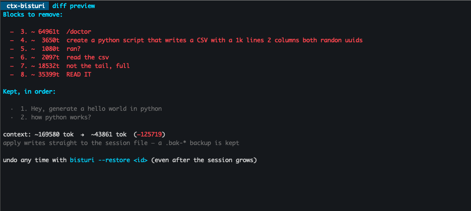
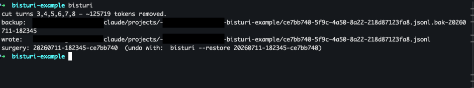
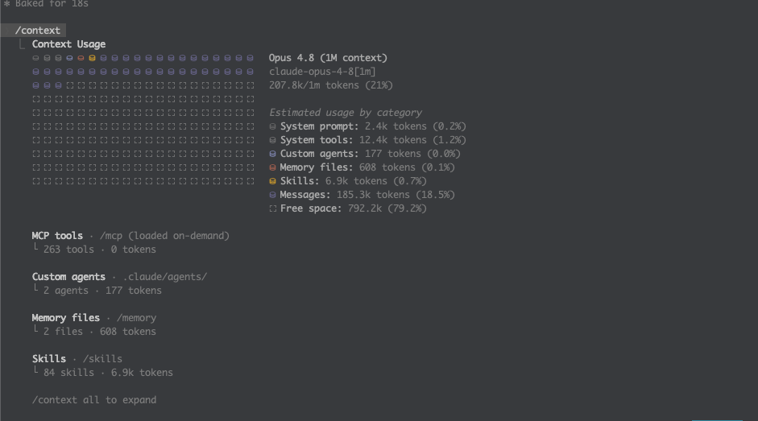
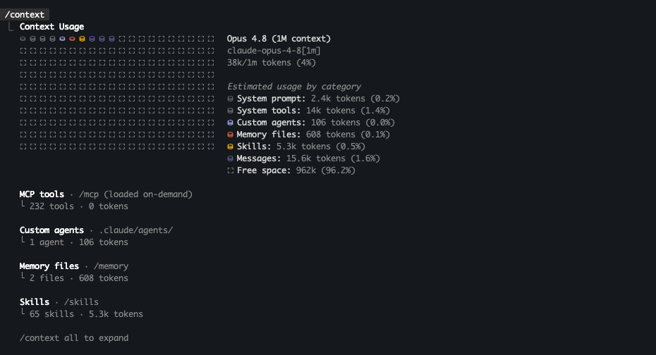

<p align="center">
  
</p>

<h1 align="center">bisturi</h1>

<p align="center">
  Surgically excise a topic from a Claude Code session's context —<br>
  keep what you need, cut out the middle you don't.
</p>

**bisturi** is Brazilian Portuguese for *scalpel* — and that's the whole idea. A
Bubble Tea TUI to pick the blocks, safe re-threading so the trimmed session still
resumes, and a local surgery log so any cut can be undone later. Not a blunt
`/clear`, not a lossy `/compact` — a clean cut of a specific span.

## The problem it solves

You start on **topic A**, then **B** comes up related to A, and now you want to
work on **C** — but B is dead weight bloating the context. You want B gone while
A and C stay intact.

The built-ins don't do this:

| Built-in | What it does | Why it's not this |
| --- | --- | --- |
| `/clear` | wipes the whole context | loses A and C too |
| `/compact` | LLM-summarizes everything | lossy; you can't choose *what* drops |
| `/rewind` (Esc·Esc) | rolls back to a checkpoint | **linear** — to drop B it also drops C |

Rewind moves one pointer back in time; it can't remove a span from the *middle*
and keep what came after. That middle-excision is the gap bisturi fills.

## See it work

Pick the blocks in the TUI — each block is one prompt **plus its full reply**,
shown with a token weight so you know what's heavy:



Press `d` to preview the exact diff before committing — what's removed, what's
kept, and the token delta:



Press `y` to apply. It writes straight to the session file, keeping a `.bak-*`
backup and a restorable surgery:



### Proof: 207.8k → 38k tokens

A real session bloated by reading a 1,000-line CSV. Cutting the CSV blocks and
restarting the session took it from **21% of the window down to 4%** — messages
dropped from **185.3k to 15.6k tokens**:

| Before the cut | After the cut + restart |
| --- | --- |
|  |  |

> The drop only lands **after you restart Claude Code** on that session — a
> running session holds its context in memory and reloads the trimmed transcript
> on `claude --resume`. bisturi reminds you of this when you apply.

## How it works

A session lives at `~/.claude/projects/<slugged-cwd>/<session-id>.jsonl`; each
line is one JSON object, and message objects are threaded by `uuid`/`parentUuid`.
Real sessions aren't a clean line — parallel tool calls, retries, sidechains and
compaction make the thread a *forest* (many roots and leaf tips). So bisturi
doesn't try to reverse-engineer one canonical path. It treats the file as what it
is — a chronological append log — and:

1. Groups it into **turns**: one real user prompt plus its attachments, tool
   results, assistant replies and metadata, up to the next prompt. Injected
   prompts (hook feedback, skill preambles) fold into their surrounding turn, so
   you select whole topics.
2. Removes the turns you pick and **relinks the survivors** into one clean linear
   chain — each surviving node points at the previous survivor. The result is
   always single-rooted, fully reachable, and free of dangling references,
   whatever the original shape, and it resumes whether Claude Code walks
   `parentUuid` from the leaf or reads the log in order.
3. Saves the cut as a **surgery** you can undo — even after the session has grown
   with new turns (anchors are matched by uuid, so later additions don't
   interfere).

## Install

**Prebuilt binary** — grab the archive for your OS/arch from the
[latest release](https://github.com/GuitarWag/bisturi/releases/latest), extract,
and put `bisturi` on your `PATH`:

```bash
# macOS (Apple Silicon) example — adjust the asset name for your platform
curl -sL https://github.com/GuitarWag/bisturi/releases/latest/download/bisturi_<version>_darwin_arm64.tar.gz | tar xz
sudo mv bisturi /usr/local/bin/
```

**With Go** (1.21+):

```bash
go install github.com/GuitarWag/bisturi@latest
```

**From source:**

```bash
git clone https://github.com/GuitarWag/bisturi && cd bisturi
go build -o bisturi .
ln -sf "$PWD/bisturi" ~/.local/bin/bisturi   # optional
```

Releases are built for linux / macOS / windows on amd64 and arm64 by GoReleaser
via GitHub Actions on each `v*` tag. Check your build with `bisturi --version`.

## Usage

```bash
bisturi                       # pick a session interactively (searchable picker), then TUI
bisturi -s 353                # match by the /rename name (what `claude --resume` shows)
bisturi -s "connection"       # …or by session id / ai-title (substring)
bisturi -a                    # pick across ALL projects, not just the cwd's
bisturi --project ~/code/app  # sessions for another project
bisturi path/to/session.jsonl # operate on a file directly
bisturi --list                # list sessions (id, rename name, ai-title)
```

Run `bisturi` from any folder: with no session named, it opens a searchable
picker. Type to filter by rename name, ai-title, or id; `enter` opens the block
TUI for that session. If the current folder has no sessions of its own, the
picker spans all projects. `-s` matches the **rename name first** — the same
name you use with `claude --resume`.

Inspect and cut without the TUI:

```bash
bisturi -s slack --print              # numbered turn breakdown + token estimates
bisturi -s slack --json               # same, as JSON (for scripts / the slash command)
bisturi FILE --cut 2,4 --dry-run      # show what would change, write nothing
bisturi FILE --cut 2-4                # writes FILE.cut.jsonl (original untouched)
bisturi FILE --cut 2 --in-place       # replace original, keep a .bak-* backup
```

Undo:

```bash
bisturi --surgeries                   # list saved cuts (undo history)
bisturi --restore <id> --in-place     # put a cut's blocks back
```

### TUI keys

| Key | Action |
| --- | --- |
| `↑`/`↓` or `k`/`j` | move between blocks |
| `space` / `x` | mark/unmark a block for cutting |
| `a` / `n` | select all / none |
| `enter` | expand the block (scroll its full interaction) |
| `d` | diff preview (what's removed, token delta, before→after) |
| `y` | apply the cut |
| `q` / `esc` | quit without changing anything |

## Inside Claude Code (`/bisturi`)

A slash command drives this from within a session. A slash command can't *host* a
full-screen TUI itself (the agent's shell has no interactive terminal), so
`/bisturi` gives you two ways to see and confirm the blocks:

- **Visual TUI** — it hands you `!bisturi -s <name>`. The `!` prefix runs it in
  your real terminal, so the checkbox TUI opens right there; its result prints
  back into the chat.
- **In-chat** — Claude lists the numbered blocks and confirms your selection with
  Claude Code's native selectable UI, then shows a dry-run before writing.

Note: you can't hot-edit the **currently running** session — Claude Code owns that
file while live. Cut a past session, or cut the current one and pick up the
trimmed context on the next `claude --resume`.

## Safety

- The original is never touched unless you pass `--in-place`, and even then a
  `.bak-<timestamp>` copy is written first.
- Every cut is also saved as a restorable surgery under
  `~/.claude/bisturi/surgeries/`.
- Writes are atomic (temp file + rename).
- Tests assert the cut chain is single-rooted, fully reachable, and dangling-free,
  and that a cut survives a restore even after the session grew.

## Caveats

- Relinking collapses abandoned branches (retries, dead tool calls) into the
  linear order. That's faithful to what happened and keeps the context complete;
  it isn't a byte-for-byte copy of the original tree.
- Token counts are estimates (~4 chars/token), for relative sizing, not billing.
- Close the session in Claude Code before cutting it in place.

## Development

```bash
go test ./...
```

The previous Python prototype is kept under `attic/python/`.
